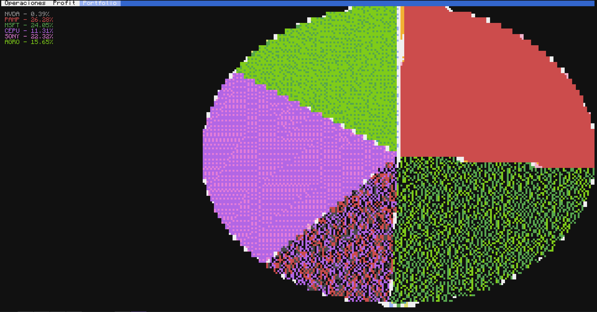
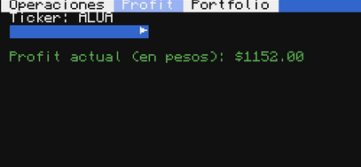
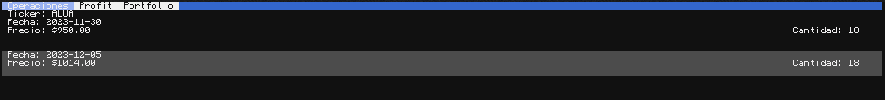

# Portfolio en CC:Tweaked (ComputerCraft)

Almacena y visualiza operaciones financieras en una base de datos, mostrándolas en **CC:Tweaked**, un mod de computadoras dentro de Minecraft. Este proyecto permite visualizar un portafolio financiero *a modo básico* dentro del juego.

## Tecnologías utilizadas

- **PostgreSQL**: para la base de datos de operaciones financieras.
- **Python (FastAPI)**: como servidor API para conectar ComputerCraft con la base de datos.
- [**Basalt UI Framework**](https://github.com/Pyroxenium/Basalt): para programar la GUI en ComputerCraft.
- **API del Broker**: para importar tus operaciones financieras.
- **CC:Tweaked (ComputerCraft) Mod**: El propósito principal de este proyecto, para verlo dentro del juego.

Actualmente la importación de operaciones está implementada con la API de IOL, pero este script puede ser fácilmente extendido a la API de PPI si se requiere.

## Instalación server-side

Clona este repositorio, `cd` hacia el directorio del mismo y ejecuta `docker compose up -d` para iniciar los containers de Postgres (DB) y Quickchart (para los pie-charts del portfolio), además del servidor FastAPI principal

## Instalación client-side (in-game)

> TODO: Escribir más en detalle una guía, pues el sistema de instalación client-side no está terminado

Descarga el install.lua hacia la computadora in-game, ejecútalo y se descargarán todos los archivos automáticamente. Al finalizar, configura el archivo config.lua y finalmente ejecuta el main.lua

## Limitaciones

Debido a la limitada paleta de colores en ComputerCraft (16 colores) y, que hay colores que Sanjuuni (librería gráfica) no procesa de manera perfecta y colores que no sirven (por ej, color negro siendo que tenemos un fondo negro), en total nos quedaron 9 colores. Si tu portfolio tiene más de 9 tickers, verás que en el pie-chart habrán tickers con colores repetidos
